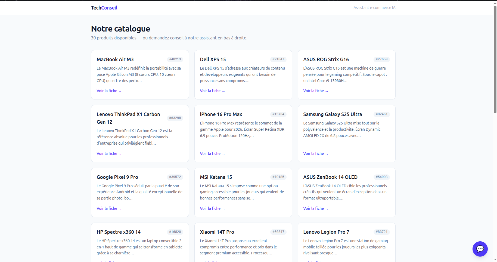
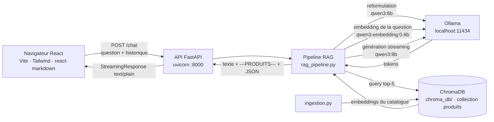

# Assistant conseil produit e-commerce (RAG local)

Assistant qui aide un client à choisir un produit informatique ou high-tech à partir
d'une demande en langage naturel, en s'appuyant sur un pipeline RAG exécuté
**entièrement en local** (Qwen3 via Ollama, ChromaDB persistant, FastAPI, React).
Aucune donnée — catalogue comme question du client — n'est envoyée à une API tierce :
le modèle de génération et le modèle d'embedding tournent sur la machine.

## Aperçu

| Catalogue | Chat RAG |
|---|---|
|  |  |

Suite de la même conversation : [réponse détaillée](docs/chat2.png), [mini-cartes de recommandation cliquables](docs/chat3.png).

> **Catalogue de démonstration : les fiches produits sont fictives, les spécifications
> et prix sont indicatifs et ne reflètent pas des offres réelles.**

## Fonctionnalités

- **Recherche sémantique** sur des descriptions en texte libre : aucun filtre
  structuré, le catalogue ne contient que `{id, description}`.
- **Reformulation des questions de suivi** : un message elliptique
  (« et moins cher ? ») est transformé en question autonome avant la recherche.
- **Tri et justification par le LLM** : parmi les 5 candidats remontés, le modèle
  ne garde que ceux réellement pertinents et justifie chaque choix sur des éléments
  concrets de la description (prix, specs, usage).
- **Réponse en streaming** token par token, de l'appel Ollama jusqu'à l'affichage
  navigateur, puis rendu Markdown une fois le flux terminé.
- **System prompt de cadrage** : refus mot pour mot des questions hors sujet,
  interdiction d'inventer un produit, honnêteté si aucun candidat ne convient.
  Les identifiants renvoyés par le modèle sont en plus filtrés côté backend sur la
  liste des candidats (garde-fou anti-hallucination).
- **Liens cliquables** depuis les recommandations du chat vers les fiches produits.
- **Chat persistant entre les pages** : le widget est monté hors du routeur, donc
  l'historique reste intact pendant la navigation.

## Architecture



Flux d'une requête :

1. Le frontend envoie la question et l'historique à `POST /chat`.
2. Si un historique existe, `qwen3:8b` reformule le message en question autonome.
3. La question est encodée par `qwen3-embedding:0.6b` (1024 dimensions) et comparée
   aux 30 descriptions indexées dans ChromaDB → les 5 plus proches.
4. `qwen3:8b` reçoit le system prompt, l'historique, la question et les 5 descriptions
   complètes, puis génère en streaming le texte de réponse.
5. Le backend coupe le flux sur le marqueur `---PRODUITS---`, parse et filtre le JSON
   des produits recommandés, puis le ré-émet validé ; le frontend affiche le texte au
   fil de l'eau et les recommandations en mini-cartes.

## Stack technique

| Composant | Technologie |
|---|---|
| Génération | `qwen3:8b` via Ollama (streaming, mode *thinking* désactivé) |
| Embeddings | `qwen3-embedding:0.6b` via Ollama (dimension 1024) |
| Vector store | ChromaDB `PersistentClient` (`chroma_db/`, collection `produits`) |
| API | FastAPI + uvicorn, validation Pydantic, `StreamingResponse` |
| Frontend | React 18, Vite 5, React Router 6, Tailwind CSS 4, react-markdown |
| Environnement Python | Python 3.11 (conda `rag-qwen`) |
| Conteneurisation | Docker Compose : image backend `python:3.11-slim`, frontend en multi-stage Node → nginx |
| Données | `data/catalogue.json` — 30 produits `{id, description}` |

## Choix techniques

**Pourquoi 100 % local.** Le catalogue et les questions clients peuvent être des
données sensibles : ici rien ne sort de la machine, aucune clé d'API à gérer et le
coût marginal d'une requête est nul, ce qui permet d'itérer sur les prompts sans
surveiller une facture. En contrepartie, la latence et la qualité dépendent du
matériel local.

**Pourquoi du texte libre sans filtres structurés.** Le catalogue imite un corpus
documentaire réel (fiches PDF, pages produits) où prix, marque et specs sont noyés
dans la prose. N'exposer que `{id, description}` force la recherche à être purement
sémantique et rend le pipeline transposable à n'importe quel corpus non structuré,
sans travail préalable d'extraction de métadonnées.

**Pourquoi fournir soi-même les embeddings à ChromaDB.** La collection est créée sans
*embedding function* : l'ingestion et la requête appellent explicitement le même
modèle Ollama. Le modèle utilisé est ainsi un choix visible dans le code plutôt qu'un
défaut implicite de la librairie, ce qui élimine le risque d'indexer avec un modèle et
d'interroger avec un autre — une incohérence silencieuse qui dégraderait la pertinence
sans lever d'erreur.

**Pourquoi le streaming.** Une génération locale de plusieurs centaines de tokens
prend plusieurs secondes : diffuser le texte au fil de l'eau rend l'attente
acceptable. Le streaming est aussi l'unique source de vérité du pipeline — la version
non streamée (`generer_reponse`) consomme le même générateur, il n'y a donc pas deux
chemins de génération à maintenir.

## Prérequis et installation

- [Ollama](https://ollama.com) installé et lancé (`ollama serve`, `localhost:11434`)
- Docker et Docker Compose v2 — pour le lancement conteneurisé
- Python 3.11 et Node.js 18+ — pour le lancement manuel uniquement
- Matériel testé : GPU 8 Go de VRAM (`qwen3:8b` quantifié + modèle d'embedding)

```bash
# 1. Modèles Ollama
ollama pull qwen3:8b
ollama pull qwen3-embedding:0.6b

# 2. Environnement Python (lancement manuel ; inutile avec Docker Compose)
conda create -n rag-qwen python=3.11 -y
conda activate rag-qwen
pip install -r backend/requirements.txt

# 3. Frontend (lancement manuel ; inutile avec Docker Compose)
cd frontend
npm install
echo "VITE_API_URL=http://localhost:8000" > .env   # non versionné
cd ..
```

## Lancement

### Avec Docker Compose (méthode principale)

Ollama n'est **pas** conteneurisé : il reste sur la machine hôte pour garder l'accès
au GPU. Les conteneurs le joignent via `host.docker.internal`, ce qui suppose
qu'Ollama écoute sur toutes les interfaces et non seulement sur la boucle locale :

```bash
# Prérequis : Ollama doit écouter sur 0.0.0.0
#   - lancement ponctuel :
OLLAMA_HOST=0.0.0.0 ollama serve
#   - ou, pour le service systemd, ajouter dans `systemctl edit ollama` :
#       [Service]
#       Environment="OLLAMA_HOST=0.0.0.0:11434"
```

> **Implication de sécurité.** Avec `OLLAMA_HOST=0.0.0.0`, Ollama est joignable par
> toute machine du réseau local, **sans aucune authentification** : n'importe qui sur
> le même réseau peut interroger les modèles et consommer le GPU. À réserver à un
> réseau de confiance, ou à restreindre par pare-feu (par exemple n'autoriser que
> l'interface `docker0`). Sur la boucle locale seule (`127.0.0.1`), les conteneurs ne
> peuvent pas atteindre Ollama.

```bash
docker compose up --build
```

Puis : <http://localhost:5173> (frontend) et <http://localhost:8000/health> (API).

Le service `ingest` s'exécute une seule fois, indexe le catalogue dans un volume
nommé (`chroma_data`) et s'arrête ; `api` ne démarre qu'après sa réussite
(`service_completed_successfully`). Si Ollama est injoignable, `ingest` échoue avec
un message explicite et la pile ne démarre pas.

```bash
docker compose logs -f api      # suivre les logs de l'API
docker compose down             # arrêter (le volume ChromaDB est conservé)
docker compose down -v          # arrêter et supprimer l'index
```

### Lancement manuel (alternative)

```bash
# 1. Indexer le catalogue dans ChromaDB (une fois, ou après modification du catalogue)
conda activate rag-qwen
python backend/ingestion.py          # --check pour seulement inspecter l'index

# 2. Backend (terminal 1) — depuis backend/, les imports sont relatifs au dossier
cd backend && uvicorn api:app --reload --port 8000

# 3. Frontend (lancement manuel ; inutile avec Docker Compose) (terminal 2)
cd frontend && npm run dev           # http://localhost:5173
```

Ce mode n'exige aucune variable d'environnement : les valeurs par défaut pointent sur
`http://localhost:11434`, `./chroma_db` et `./data/catalogue.json`. Les réglages
surchargeables sont documentés dans `.env.example`.

### Debug en ligne de commande, sans frontend

```bash
python backend/rag_pipeline.py       # boucle interactive, affiche les étapes
python backend/test_stream.py        # cas clés : hors sujet, produit absent, cas normal
curl -N --no-buffer -X POST http://localhost:8000/chat \
     -H 'Content-Type: application/json' \
     -d '{"question": "un laptop léger pour voyager"}'
```

## Endpoints de l'API

| Méthode | Route | Rôle |
|---|---|---|
| GET | `/health` | Statut de l'API, accessibilité d'Ollama, modèles utilisés, nombre de produits indexés |
| POST | `/chat` | Question + historique → réponse en streaming (`text/plain`) : texte, puis `---PRODUITS---`, puis le JSON des recommandations |
| GET | `/produits` | Catalogue complet (30 produits) |
| GET | `/produits/{id}` | Un produit, 404 si l'identifiant est inconnu |

CORS autorisé pour `http://localhost:3000` et `http://localhost:5173`.

## Limites connues

- Les spécifications et prix du catalogue de démonstration ne sont pas vérifiés et ne
  correspondent à aucune offre réelle.
- Catalogue volontairement réduit à 30 produits : pas de pagination, pas de découpage
  en *chunks* (une description = un document), `top_k` fixé à 5.
- Aucune évaluation chiffrée du retrieval ni de la génération à ce stade : la
  validation est manuelle (`backend/test_stream.py` et la CLI de debug).
- Pas de CI ni de tests automatisés.
- Pas d'authentification ni de limitation de débit sur l'API.

## Roadmap (à venir)

- Jeu d'évaluation du retrieval : paires question/produit attendu et mesure du
  recall@k pour comparer modèles d'embedding et valeurs de `top_k`.
- CI GitHub Actions : lint et tests du pipeline sur un double d'Ollama.
- Monitoring : latence par étape, taux de réponses sans recommandation, traces des
  requêtes.
